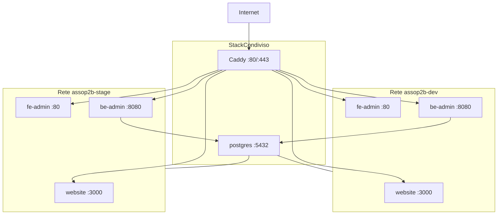

# assop2b-configurations

Configurazione di deploy multi-environment per Asso-P2B su una singola VPS.

Lo script [`init-vps.sh`](init-vps.sh) orchestra l'inizializzazione completa: clone dei repository applicativi, generazione dei file Docker Compose, configurazione TLS con Caddy e provisioning PostgreSQL condiviso tra gli environment.

## Prerequisiti

- `git`
- Docker Compose plugin v2 (`docker compose`)
- `openssl`
- Accesso GitHub con Personal Access Token (scope `repo`)

Le credenziali GitHub vengono richieste in modo one-shot durante l'esecuzione dello script e non vengono salvate sulla macchina.

## Avvio rapido

```bash
cd /path/to/assop2b-configurations
chmod +x init-vps.sh
./init-vps.sh
```

Lo script guida l'operatore attraverso:

1. Selezione degli environment da inizializzare (`dev`, `stage`, `prod` o tutti)
2. Autenticazione GitHub one-shot
3. Clone/aggiornamento dei repository per ogni environment
4. Prompt interattivo per i domini di ogni environment
5. Generazione automatica delle credenziali database
6. Avvio dello stack condiviso (Caddy + PostgreSQL)

## Architettura

Il deploy si articola su due livelli:

- **Stack per environment** — `{env}/docker-compose.yml`: servizi `website`, `fe-admin` e `be-admin` su rete Docker isolata `assop2b-{env}`
- **Stack condiviso** — `docker-compose.shared.yml`: Caddy (reverse proxy TLS) e PostgreSQL (un container, database e utente dedicati per environment)



### Routing Caddy

Il file `caddy/Caddyfile` viene generato automaticamente da `init-vps.sh`:

| Variabile | Destinazione |
|-----------|--------------|
| `DOMAIN_WEBSITE` | `assop2b-{env}-website:3000` |
| `DOMAIN_ADMIN` | `assop2b-{env}-fe-admin:80` |
| `DOMAIN_API` | `assop2b-{env}-be-admin:8080` |

### Mapping branch Git

| Environment | Branch |
|-------------|--------|
| `dev` | `dev` |
| `stage` | `stage` |
| `prod` | `main` |

## Struttura directory dopo init

```
assop2b-configurations/
├── init-vps.sh
├── docker-compose-model.yml
├── docker-compose-shared-model.yml
├── .env.shared                    # generato
├── docker-compose.shared.yml      # generato
├── caddy/
│   └── Caddyfile                  # generato
├── postgres/
│   └── init/
│       └── 00-environments.sql    # generato
├── dev/
│   ├── .env
│   ├── docker-compose.yml
│   ├── assop2b-website/
│   ├── assop2b-be-admin/
│   └── assop2b-fe-admin/
├── stage/
│   └── ...
└── prod/
    └── ...
```

## Variabili d'ambiente

### `.env.shared` (stack condiviso)

| Variabile | Descrizione |
|-----------|-------------|
| `ACME_EMAIL` | Email Let's Encrypt (richiesta a prompt) |
| `POSTGRES_PASSWORD` | Password superuser PostgreSQL (auto-generata) |

### `{env}/.env` (per environment)

| Variabile | Descrizione |
|-----------|-------------|
| `DOMAIN_WEBSITE` | Dominio sito pubblico (richiesto a prompt) |
| `DOMAIN_ADMIN` | Dominio frontend admin (richiesto a prompt) |
| `DOMAIN_API` | Dominio API backend (richiesto a prompt) |
| `DB_HOST` | Hostname del container PostgreSQL (`postgres`) |
| `DB_PORT` | Porta PostgreSQL (`5432`) |
| `DB_NAME` | Nome database (`assop2b_{env}`) |
| `DB_USER` | Utente database (`assop2b_{env}`) |
| `DB_PASSWORD` | Password auto-generata (non sovrascritta su re-run) |
| `DATABASE_URL` | Connection string completa |

Il servizio `be-admin` riceve `{env}/.env` tramite `env_file` definito in [`docker-compose-model.yml`](docker-compose-model.yml).

Esempio per l'environment `dev`:

```bash
DB_HOST=postgres
DB_PORT=5432
DB_NAME=assop2b_dev
DB_USER=assop2b_dev
DB_PASSWORD=<generata>
DATABASE_URL=postgresql://assop2b_dev:<generata>@postgres:5432/assop2b_dev
```

## PostgreSQL condiviso

Un solo container PostgreSQL (`assop2b-postgres`) serve tutti gli environment. Per ogni environment inizializzato vengono creati:

- un database dedicato (`assop2b_dev`, `assop2b_stage`, …)
- un utente dedicato con accesso esclusivo al proprio database

Lo script SQL di inizializzazione viene generato in `postgres/init/00-environments.sql` e montato nel container al path `/docker-entrypoint-initdb.d/`.

### Limitazione: primo avvio del volume

Gli script in `/docker-entrypoint-initdb.d/` vengono eseguiti **solo al primo avvio** del volume Docker `postgres_data`. Se si aggiunge un nuovo environment a un'istanza PostgreSQL già in esecuzione, occorre:

1. **SQL manuale** — connettersi al container ed eseguire `CREATE USER`, `CREATE DATABASE` e `GRANT` per il nuovo environment, oppure
2. **Reset del volume** — eliminare il volume `postgres_data` e riavviare lo stack condiviso (perde tutti i dati esistenti)

```bash
# Esempio: aggiunta manuale di un database per stage
docker exec -it assop2b-postgres psql -U postgres <<'SQL'
CREATE USER assop2b_stage WITH PASSWORD 'password-da-env-stage';
CREATE DATABASE assop2b_stage OWNER assop2b_stage;
GRANT ALL PRIVILEGES ON DATABASE assop2b_stage TO assop2b_stage;
SQL
```

## Operazioni comuni

### Stack condiviso

```bash
docker compose -f docker-compose.shared.yml up -d
docker compose -f docker-compose.shared.yml logs -f caddy
docker compose -f docker-compose.shared.yml logs -f postgres
docker compose -f docker-compose.shared.yml down
```

### Singolo environment

```bash
cd dev
docker compose up -d
docker compose build website && docker compose up -d website
docker compose build fe-admin && docker compose up -d fe-admin
docker compose build be-admin && docker compose up -d be-admin
docker compose logs -f be-admin
```

### Verifica database

```bash
# Elenco database
docker exec assop2b-postgres psql -U postgres -c '\l'

# Verifica credenziali nel container be-admin
docker exec assop2b-dev-be-admin env | grep DB_

# Test connettività da be-admin verso postgres
docker exec assop2b-dev-be-admin wget -qO- http://127.0.0.1:8080/
```

## File sorgente vs generati

| File | Tipo | Descrizione |
|------|------|-------------|
| `init-vps.sh` | Sorgente | Script di inizializzazione VPS |
| `docker-compose-model.yml` | Sorgente | Template compose per environment |
| `docker-compose-shared-model.yml` | Sorgente | Template compose stack condiviso |
| `.env.shared` | Generato | Credenziali e config stack condiviso |
| `docker-compose.shared.yml` | Generato | Compose stack condiviso (Caddy + PostgreSQL) |
| `caddy/Caddyfile` | Generato | Configurazione reverse proxy TLS |
| `postgres/init/00-environments.sql` | Generato | Script init database per environment |
| `{env}/.env` | Generato | Domini e credenziali per environment |
| `{env}/docker-compose.yml` | Generato | Compose dell'environment |
| `{env}/assop2b-*` | Clonati | Repository applicativi |

I file generati contengono domini reali e credenziali: **non committarli** nel repository di configurazione.
