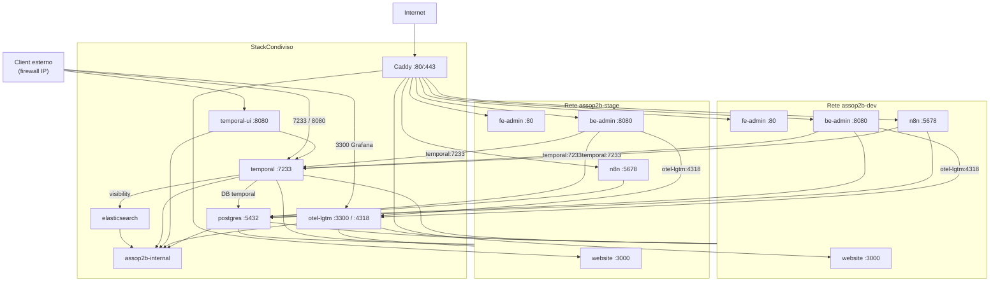

# assop2b-configurations

Configurazione di deploy multi-environment per Asso-P2B su una singola VPS.

Lo script [`init-vps.sh`](init-vps.sh) orchestra l'inizializzazione completa: clone dei repository applicativi, generazione dei file Docker Compose, configurazione TLS con Caddy e provisioning PostgreSQL condiviso tra gli environment.

## Prerequisiti

- `git`
- Docker Compose plugin v2 (`docker compose`)
- `openssl`
- Accesso GitHub con Personal Access Token (scope `repo`)

Le credenziali GitHub vengono richieste in modo one-shot durante l'esecuzione dello script e non vengono salvate sulla macchina.

## Avvio rapido

```bash
cd /path/to/assop2b-configurations
chmod +x init-vps.sh
./init-vps.sh
```

Lo script guida l'operatore attraverso:

1. Selezione degli environment da inizializzare (`dev`, `stage`, `prod` o tutti)
2. Autenticazione GitHub one-shot
3. Clone/aggiornamento dei repository per ogni environment
4. Prompt interattivo per i domini di ogni environment
5. Generazione automatica delle credenziali database
6. Avvio dello stack condiviso (Caddy + PostgreSQL + Temporal + Elasticsearch + otel-lgtm)

## Architettura

Il deploy si articola su due livelli (motivazione in [ADR 0001](docs/adr/0001-confini-stack-condiviso-vs-environment.md)):

- **Stack per environment** — `{env}/docker-compose.yml`: servizi `website`, `fe-admin`, `be-admin` e `n8n` su rete Docker isolata `assop2b-{env}`
- **Stack condiviso** — `docker-compose.shared.yml`: Caddy (reverse proxy TLS), PostgreSQL, Elasticsearch, Temporal Server, Temporal Web UI e otel-lgtm (OpenTelemetry + Grafana)



### Reti Docker (stack condiviso)

| Servizio | Reti |
|----------|------|
| `postgres` | `assop2b-{env}` (tutti) + `assop2b-internal` |
| `elasticsearch` | solo `assop2b-internal` |
| `temporal` | `assop2b-{env}` (tutti) + `assop2b-internal` |
| `temporal-ui` | solo `assop2b-internal` (+ porta host `8080`) |
| `otel-lgtm` | `assop2b-{env}` (tutti) + `assop2b-internal` (+ porta host `3300` → Grafana `:3000`) |
| `alloy` | solo `assop2b-internal` |
| `caddy` | `assop2b-{env}` (tutti) |

I container applicativi su ogni environment raggiungono Temporal via hostname `temporal:7233` e il collector OTLP via `otel-lgtm:4318`. Elasticsearch non è esposto su host né sulle reti environment.

### Routing Caddy

Il file `caddy/Caddyfile` viene generato automaticamente da `init-vps.sh`:

| Variabile | Destinazione |
|-----------|--------------|
| `DOMAIN_WEBSITE` | `assop2b-{env}-website:3000` |
| `DOMAIN_ADMIN` | `assop2b-{env}-fe-admin:80` |
| `DOMAIN_API` | `assop2b-{env}-be-admin:8080` |
| `DOMAIN_N8N` | `assop2b-{env}-n8n:5678` |

### Mapping branch Git

| Environment | Branch |
|-------------|--------|
| `dev` | `dev` |
| `stage` | `stage` |
| `prod` | `main` |

## ADR

Le decisioni architetturali rilevanti sono tracciate come **Architectural Decision Record** in [`docs/adr/`](docs/adr/).

| ADR | Titolo | Status |
|-----|--------|--------|
| [0001](docs/adr/0001-confini-stack-condiviso-vs-environment.md) | Confini e responsabilità tra stack condiviso e stack per environment | Accepted |
| [0002](docs/adr/0002-drizzle-orm.md) | Drizzle ORM per persistenza applicativa (assop2b-be-admin) | Accepted |

Per il contesto operativo (compose, variabili, troubleshooting) fare riferimento alle sezioni seguenti di questo README.

## Struttura directory dopo init

```
assop2b-configurations/
├── init-vps.sh
├── docker-compose-model.yml
├── docker-compose-shared-model.yml
├── .env.shared                    # generato
├── docker-compose.shared.yml      # generato
├── caddy/
│   └── Caddyfile                  # generato
├── postgres/
│   └── init/
│       └── 00-environments.sql    # generato
├── dev/
│   ├── .env
│   ├── docker-compose.yml
│   ├── assop2b-website/
│   ├── assop2b-be-admin/
│   └── assop2b-fe-admin/
├── stage/
│   └── ...
└── prod/
    └── ...
```

## Variabili d'ambiente

### `.env.shared` (stack condiviso)

| Variabile | Descrizione |
|-----------|-------------|
| `ACME_EMAIL` | Email Let's Encrypt (richiesta a prompt) |
| `POSTGRES_PASSWORD` | Password superuser PostgreSQL (auto-generata) |
| `TEMPORAL_DB_USER` | Utente PostgreSQL Temporal (`temporal`) |
| `TEMPORAL_DB_PASSWORD` | Password database Temporal (auto-generata, non sovrascritta su re-run) |
| `TEMPORAL_NAMESPACE_RETENTION` | Retention dei namespace Temporal (`720h`, auto-generata) |
| `GRAFANA_ADMIN_USER` | Utente admin Grafana otel-lgtm (`admin`, auto-generato) |
| `GRAFANA_ADMIN_PASSWORD` | Password admin Grafana (auto-generata, non sovrascritta su re-run) |

Per lo stack condiviso usare sempre `docker compose --env-file .env.shared`: le variabili `${TEMPORAL_DB_*}` e `${GRAFANA_ADMIN_*}` nel compose vengono interpolate da quel file (non da `env_file` a runtime).

### `{env}/.env` (per environment)

Contiene **solo dati che variano per environment** (domini, secret, credenziali DB). Costanti e valori derivabili (OTEL, n8n host/webhook, `DB_POSTGRESDB_*`) sono nel `docker-compose.yml` generato da [`docker-compose-model.yml`](docker-compose-model.yml).

| Variabile | Descrizione |
|-----------|-------------|
| `DOMAIN_WEBSITE` | Dominio sito pubblico (richiesto a prompt) |
| `DOMAIN_ADMIN` | Dominio frontend admin (richiesto a prompt) |
| `DOMAIN_API` | Dominio API backend (richiesto a prompt) |
| `DOMAIN_N8N` | Dominio n8n (richiesto a prompt) |
| `DB_NAME` | Nome database applicativo (`assop2b_{env}`) |
| `DB_USER` | Utente database applicativo (`assop2b_{env}`) |
| `DB_PASSWORD` | Password auto-generata (non sovrascritta su re-run) |
| `DATABASE_URL` | Connection string completa per be-admin |
| `DB_SEED` | Seed dati demo be-admin (`true` di default) — auto-impostato da `init-vps.sh` se assente |
| `N8N_DB_NAME` | Database n8n (`n8n_{env}`) |
| `N8N_DB_USER` | Utente database n8n (`n8n_{env}`) |
| `N8N_DB_PASSWORD` | Password database n8n (auto-generata, non sovrascritta su re-run) |
| `N8N_ENCRYPTION_KEY` | Chiave crittografica n8n (auto-generata, non sovrascritta su re-run) |
| `JWT_ACCESS_SECRET` | Secret JWT access token — **auto-generato** da `init-vps.sh` se assente |
| `JWT_REFRESH_SECRET` | Secret JWT refresh token — auto-generato |
| `JWT_LOGIN_CHALLENGE_SECRET` | Secret JWT step 2FA — auto-generato |
| `TOTP_ENCRYPTION_KEY` | Chiave AES per secret TOTP in DB — auto-generata |
| `COOKIE_SECRET` | Firma cookie (`@fastify/cookie`) — auto-generata |
| `API_KEY_ENV` | Prefisso env nelle API key (`test` per dev/stage, `live` per prod) — auto-impostato |
| `WEBSITE_CMS_API_KEY` | API key M2M (`cms.read`) per `website` — auto-generata; registrata in DB dal seed be-admin (`DB_SEED=true`) |

`init-vps.sh` (`ensure_auth_credentials`) aggiunge le variabili auth sopra **solo se mancanti** (re-run idempotente). `prune_redundant_env_vars` rimuove da `.env` le chiavi migrate nel compose (idempotente su re-run). Il refresh JWT usa un cookie host-only sul dominio API (nessun attributo `Domain`).

**Nel `docker-compose.yml` per environment** (non in `.env`):

| Servizio | Variabili |
|----------|-----------|
| `be-admin` | `OTEL_EXPORTER_OTLP_ENDPOINT`, `OTEL_EXPORTER_OTLP_PROTOCOL`, `OTEL_SERVICE_NAME` |
| `n8n` | `DB_TYPE`, `DB_POSTGRESDB_*` (da `N8N_DB_*`), `N8N_HOST` / `WEBHOOK_URL` (da `DOMAIN_N8N`), costanti (`N8N_PROTOCOL`, `N8N_PORT`, …) |
| `website` | `NUXT_CMS_API_KEY` da `${WEBSITE_CMS_API_KEY}` (interpolazione compose) |

`be-admin` e `n8n` caricano comunque `{env}/.env` via `env_file` per secret e domini.

Esempio per l'environment `dev`:

```bash
DOMAIN_WEBSITE=development.assop2b.it
DOMAIN_ADMIN=development.fe.assop2b.it
DOMAIN_API=development.be.assop2b.it
DOMAIN_N8N=development.n8n.assop2b.it
DB_NAME=assop2b_dev
DB_USER=assop2b_dev
DB_PASSWORD=<generata>
DATABASE_URL=postgresql://assop2b_dev:<generata>@postgres:5432/assop2b_dev
DB_SEED=true
N8N_DB_NAME=n8n_dev
N8N_DB_USER=n8n_dev
N8N_DB_PASSWORD=<generata>
N8N_ENCRYPTION_KEY=<generata>
JWT_ACCESS_SECRET=<generata>
# … altri secret auth …
WEBSITE_CMS_API_KEY=<generata>
```

### Migrazione VPS esistenti

Se `{env}/.env` contiene ancora variabili obsolete (`DB_HOST`, `DB_POSTGRESDB_*`, `TEMPORAL_ADDRESS`, `OTEL_*`, …):

1. Aggiornare `init-vps.sh` e `docker-compose-model.yml` sul server
2. Rieseguire `init-vps.sh` (la fase `setup_shared` rigenera i compose, esegue il prune e riavvia `be-admin` / `n8n`)
3. Verificare:

```bash
docker exec assop2b-dev-be-admin env | grep OTEL_
docker exec assop2b-dev-n8n env | grep -E 'DB_POSTGRESDB|N8N_HOST|WEBHOOK'
grep -E '^(DB_HOST|TEMPORAL_ADDRESS|OTEL_EXPORTER)' dev/.env && echo "obsolete keys still present" || echo "ok"
```

In alternativa manuale: rigenerare `{env}/docker-compose.yml` con `sed 's/__ENV__/dev/g' docker-compose-model.yml > dev/docker-compose.yml`, rimuovere le chiavi obsolete da `.env`, poi `docker compose up -d be-admin n8n` nella directory dell'environment.

## OpenTelemetry / otel-lgtm (stack condiviso)

Il container [`grafana/otel-lgtm`](https://hub.docker.com/r/grafana/otel-lgtm) (`assop2b-otel-lgtm`) fornisce un backend OpenTelemetry all-in-one per metriche, log e trace:

- **OpenTelemetry Collector** — riceve segnali OTLP su `:4317` (gRPC) e `:4318` (HTTP), solo rete Docker
- **Grafana** — UI su porta host `3300` (mapping `3300:3000`; la `3000` host è usata da `website`)
- **Loki** — log
- **Tempo** — trace (**Tempo** ≠ **Temporal**, il motore workflow già presente nello stack)
- **Prometheus** — metriche (interno al container, non raggiungibile dalla rete Docker; usare OTLP `:4318`)

L'immagine è pensata da Grafana Labs per **dev, demo e test**; non sostituisce una piattaforma di osservabilità di produzione.

### Grafana Alloy (metriche host e Docker)

Il servizio `alloy` (`assop2b-alloy`) raccoglie metriche del host e dei container Docker e le invia a otel-lgtm via **OTLP HTTP** (`http://otel-lgtm:4318`). Configurazione in [`alloy/config.alloy`](alloy/config.alloy).

Non usare `prometheus.remote_write` verso `:9009`: in `grafana/otel-lgtm:0.28` non c'è Mimir esposto in rete; Prometheus e gli altri backend ascoltano solo su `127.0.0.1` dentro il container otel-lgtm.

### Accesso a otel-lgtm

| Modalità | Endpoint | Uso |
|----------|----------|-----|
| Grafana UI (host) | `http://<host-vps>:3300` | dashboard (credenziali `GRAFANA_ADMIN_*` in `.env.shared`) |
| OTLP HTTP (Docker) | `http://otel-lgtm:4318` | export da container su `assop2b-{env}` |
| OTLP gRPC (Docker) | `otel-lgtm:4317` | export gRPC (alternativa a HTTP) |

**Sicurezza:** la porta host `3300` è esposta su tutte le interfacce. Limitare l'accesso via firewall VPS (es. solo IP fidati). Le porte OTLP `4317`/`4318` non sono mappate sull'host.

**Dati in Grafana:** senza SDK OpenTelemetry nelle applicazioni non compariranno metriche, trace o log. Le variabili `OTEL_*` sono nel `docker-compose.yml` di `be-admin` (non in `{env}/.env`).

### Troubleshooting otel-lgtm

```bash
# Log avvio stack LGTM
docker compose --env-file .env.shared -f docker-compose.shared.yml logs -f otel-lgtm

# Health Grafana (interno al container)
docker exec assop2b-otel-lgtm wget -qO- http://127.0.0.1:3000/api/health

# Variabili OTEL nel container be-admin
docker exec assop2b-dev-be-admin env | grep OTEL_

# Connettività OTLP da be-admin
docker exec assop2b-dev-be-admin sh -c 'nc -zv otel-lgtm 4318 2>&1 || true'

# Log Alloy (export OTLP verso otel-lgtm)
docker compose --env-file .env.shared -f docker-compose.shared.yml logs -f alloy
docker compose --env-file .env.shared -f docker-compose.shared.yml up -d otel-lgtm alloy
```

Usare sempre `--env-file .env.shared` con lo stack condiviso, altrimenti Docker Compose avvisa che `GRAFANA_ADMIN_*` e `TEMPORAL_DB_*` non sono impostate.

## Temporal (stack condiviso)

Temporal Server è un servizio condiviso tra tutti gli environment:

- **Persistenza workflow** — database PostgreSQL `temporal` (utente `temporal`, credenziali in `.env.shared`)
- **Visibility** — Elasticsearch (`assop2b-elasticsearch`, rete interna, heap 256 MB)
- **Namespace** — uno per ogni environment inizializzato (`dev`, `stage`, `prod`), retention `720h`
- **Nessun routing Caddy** — Temporal non è esposto via HTTPS pubblico

### Namespace Temporal

| Environment | Namespace | Note |
|-------------|-----------|------|
| `dev` | `dev` | Registrato da `ensure_temporal_namespaces` (nome env) |
| `stage` | `stage` | Idem |
| `prod` | `prod` | Idem |

Solo gli environment con `{env}/.env` presente ricevono un namespace (registrato da `init-vps.sh` dopo l'avvio dello stack condiviso). Il namespace `default` non viene creato (`SKIP_DEFAULT_NAMESPACE_CREATION=true`).

Per aggiungere un nuovo environment a un'istanza Temporal già in esecuzione, eseguire manualmente:

```bash
docker exec assop2b-temporal temporal operator namespace create \
  --namespace stage --retention 720h --description "Asso-P2B stage" \
  --address temporal:7233
```

Verifica namespace registrati:

```bash
docker exec assop2b-temporal temporal operator namespace list --address temporal:7233
```

### Accesso a Temporal

| Modalità | Endpoint | Uso |
|----------|----------|-----|
| Interna (Docker) | `temporal:7233` | container su `assop2b-{env}` (be-admin, worker, SDK) |
| Esterna (host) | `<host-vps>:7233` | client/worker fuori da Docker |
| Web UI (host) | `http://<host-vps>:8080` | interfaccia Temporal |

**Sicurezza:** le porte host `7233` e `8080` sono esposte su tutte le interfacce. Limitare l'accesso via firewall VPS (es. solo IP fidati). Elasticsearch resta sulla rete interna e non è mappato su host.

Temporal è collegato a più reti Docker (`assop2b-{env}` + `assop2b-internal`); nel compose è impostato `BIND_ON_IP=0.0.0.0` affinché gRPC sia raggiungibile da UI e container applicativi su reti diverse.

### Troubleshooting Temporal

```bash
# Verifica che Temporal ascolti su tutte le interfacce (non solo su un IP di rete)
docker exec assop2b-temporal netstat -ln | grep 7233

# Health gRPC da UI / rete interna
docker exec assop2b-temporal-ui wget -qO- http://localhost:8080/api/v1/namespaces 2>&1 | head -5

# Log setup (schema Postgres / indici ES)
docker compose --env-file .env.shared -f docker-compose.shared.yml logs -f temporal
```

## PostgreSQL condiviso

Un solo container PostgreSQL (`assop2b-postgres`) serve tutti gli environment. Per ogni environment inizializzato vengono creati:

- un database applicativo dedicato (`assop2b_dev`, `assop2b_stage`, …) con utente `assop2b_{env}`
- un database n8n dedicato (`n8n_dev`, `n8n_stage`, …) con utente `n8n_{env}`

In aggiunta, uno **shared** database Temporal:

- database `temporal` con utente `temporal` (visibility su Elasticsearch, non su Postgres)

Lo script SQL di inizializzazione viene generato in `postgres/init/00-environments.sql` e montato nel container al path `/docker-entrypoint-initdb.d/`.

La porta `5432` è esposta sull'host (`5432:5432`), raggiungibile da qualsiasi interfaccia di rete. I container applicativi continuano a connettersi internamente via hostname `postgres`. Per l'accesso dall'esterno usare le credenziali dell'environment (`assop2b_{env}`), non il superuser `postgres`.

**Sicurezza:** con la porta esposta, limitare l'accesso tramite firewall VPS (es. consentire solo IP fidati) per ridurre il rischio di accessi non autorizzati.

### Limitazione: primo avvio del volume

Gli script in `/docker-entrypoint-initdb.d/` vengono eseguiti **solo al primo avvio** del volume Docker `postgres_data`. Se si aggiunge un nuovo environment a un'istanza PostgreSQL già in esecuzione, occorre:

1. **SQL manuale** — connettersi al container ed eseguire `CREATE USER`, `CREATE DATABASE` e `GRANT` per il nuovo environment, oppure
2. **Reset del volume** — eliminare il volume `postgres_data` e riavviare lo stack condiviso (perde tutti i dati esistenti)

```bash
# Esempio: aggiunta manuale di database per stage
docker exec -it assop2b-postgres psql -U postgres <<'SQL'
CREATE USER assop2b_stage WITH PASSWORD 'password-da-env-stage';
CREATE DATABASE assop2b_stage OWNER assop2b_stage;
GRANT ALL PRIVILEGES ON DATABASE assop2b_stage TO assop2b_stage;

CREATE USER n8n_stage WITH PASSWORD 'password-n8n-da-env-stage';
CREATE DATABASE n8n_stage OWNER n8n_stage;
GRANT ALL PRIVILEGES ON DATABASE n8n_stage TO n8n_stage;

CREATE USER temporal WITH PASSWORD 'password-da-env-shared';
CREATE DATABASE temporal OWNER temporal;
GRANT ALL PRIVILEGES ON DATABASE temporal TO temporal;
SQL
```

## Operazioni comuni

### Stack condiviso

```bash
docker compose --env-file .env.shared -f docker-compose.shared.yml up -d
docker compose --env-file .env.shared -f docker-compose.shared.yml logs -f caddy
docker compose --env-file .env.shared -f docker-compose.shared.yml logs -f postgres
docker compose --env-file .env.shared -f docker-compose.shared.yml logs -f elasticsearch
docker compose --env-file .env.shared -f docker-compose.shared.yml logs -f temporal
docker compose --env-file .env.shared -f docker-compose.shared.yml logs -f temporal-ui
docker compose --env-file .env.shared -f docker-compose.shared.yml logs -f otel-lgtm
docker compose --env-file .env.shared -f docker-compose.shared.yml up -d elasticsearch temporal temporal-ui otel-lgtm
docker compose --env-file .env.shared -f docker-compose.shared.yml down
```

### Singolo environment

```bash
cd dev
docker compose up -d
docker compose build website && docker compose up -d website
docker compose build fe-admin && docker compose up -d fe-admin
docker compose build be-admin && docker compose up -d be-admin
docker compose pull n8n && docker compose up -d n8n
docker compose logs -f be-admin
docker compose logs -f n8n
```

### Verifica database

```bash
# Elenco database
docker exec assop2b-postgres psql -U postgres -c '\l'

# Verifica credenziali nel container be-admin
docker exec assop2b-dev-be-admin env | grep DB_

# Connessione dall'esterno (sostituire host e password con i valori da dev/.env)
psql "postgresql://assop2b_dev:<password>@<host-vps>:5432/assop2b_dev"

# Test connettività da be-admin verso postgres
docker exec assop2b-dev-be-admin wget -qO- http://127.0.0.1:8080/

# Test connettività interna verso Temporal
docker exec assop2b-dev-be-admin sh -c 'nc -zv temporal 7233 2>&1 || true'

# Health Elasticsearch (rete interna)
docker exec assop2b-elasticsearch curl -s http://localhost:9200/_cluster/health
```

## File sorgente vs generati

| File | Tipo | Descrizione |
|------|------|-------------|
| `init-vps.sh` | Sorgente | Script di inizializzazione VPS |
| `docker-compose-model.yml` | Sorgente | Template compose per environment |
| `docker-compose-shared-model.yml` | Sorgente | Template compose stack condiviso |
| `.env.shared` | Generato | Credenziali e config stack condiviso |
| `docker-compose.shared.yml` | Generato | Compose stack condiviso (Caddy + PostgreSQL + Temporal + Elasticsearch + otel-lgtm) |
| `caddy/Caddyfile` | Generato | Configurazione reverse proxy TLS |
| `postgres/init/00-environments.sql` | Generato | Script init database per environment |
| `{env}/.env` | Generato | Domini e credenziali per environment |
| `{env}/docker-compose.yml` | Generato | Compose dell'environment |
| `{env}/assop2b-*` | Clonati | Repository applicativi |

I file generati contengono domini reali e credenziali: **non committarli** nel repository di configurazione.
