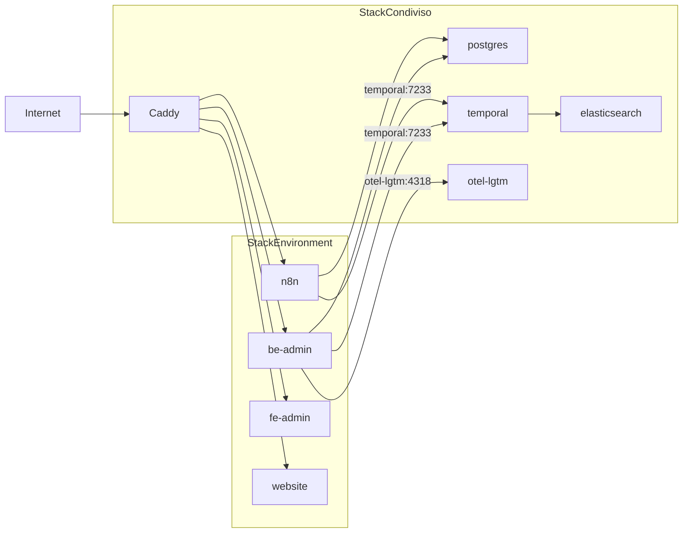

# ADR 0001 — Confini e responsabilità tra stack condiviso e stack per environment

## Status

Accepted

## Context

Asso P2B viene deployato su una singola VPS con più environment (`dev`, `stage`, `prod`) conviventi sulla stessa macchina. Ogni environment esegue i propri servizi applicativi (website, frontend admin, backend admin, n8n) con domini, branch Git e credenziali dedicate.

Senza confini espliciti, le alternative tipiche sono:

- **Stack completamente isolato per environment** — ogni ambiente replica Caddy, PostgreSQL, Temporal, osservabilità e infrastruttura di supporto. Massima separazione, ma costo operativo e consumo risorse moltiplicati su una VPS.
- **Monolite unico** — un solo stack applicativo e un solo database condiviso tra ambienti. Minore complessità infrastrutturale, ma rischio elevato di accoppiamento dati e configurazioni tra `dev`, `stage` e `prod`.
- **Separazione ibrida** — servizi infrastrutturali condivisi, workload applicativi isolati per environment.

Il repository `assop2b-configurations` implementa già la terza opzione tramite due livelli di compose (`docker-compose.shared.yml` e `{env}/docker-compose.yml`), reti Docker dedicate e provisioning guidato da `init-vps.sh`. Questa decisione non era però formalizzata in un record architetturale tracciabile.

## Decision

Adottiamo un modello a **due stack** con confini di rete, responsabilità e ciclo di vita distinti.

### Stack condiviso (`docker-compose.shared.yml`)

Servizi infrastrutturali, un'unica istanza per VPS:

| Servizio | Responsabilità |
|----------|------------------|
| `caddy` | Terminazione TLS, routing HTTP(S) verso i container applicativi per dominio |
| `postgres` | Persistenza relazionale condivisa; database e utenti separati per environment |
| `temporal` | Motore workflow condiviso; namespace separato per environment |
| `elasticsearch` | Visibility store per Temporal (rete interna) |
| `temporal-ui` | Interfaccia operativa Temporal (rete interna + porta host) |
| `otel-lgtm` | Backend osservabilità all-in-one (metriche, log, trace) |
| `alloy` | Raccolta metriche host/Docker verso otel-lgtm |

Configurazione e credenziali in `.env.shared`. Rete interna aggiuntiva `assop2b-internal` per servizi che non devono essere raggiungibili direttamente dai container applicativi (es. `elasticsearch`, `temporal-ui`, `alloy`).

### Stack per environment (`{env}/docker-compose.yml`)

Workload applicativo, un'istanza per environment:

| Servizio | Responsabilità |
|----------|------------------|
| `website` | Sito pubblico |
| `fe-admin` | Frontend backoffice |
| `be-admin` | API backend |
| `n8n` | Automazioni workflow |

Configurazione in `{env}/.env` (domini, credenziali DB, namespace Temporal, variabili OTEL). Rete Docker isolata `assop2b-{env}`.

### Regole di interazione

1. **Ingresso pubblico** — solo `caddy` espone `80`/`443`. I servizi applicativi non pubblicano porte host; sono raggiungibili via reverse proxy per dominio.
2. **Isolamento rete environment** — i container su `assop2b-{env}` non comunicano tra reti di environment diversi.
3. **Accesso ai servizi condivisi** — i container applicativi raggiungono `postgres`, `temporal` e `otel-lgtm` tramite hostname Docker su reti condivise esplicitamente configurate in `init-vps.sh`.
4. **Separazione dati** — un database applicativo (`assop2b_{env}`), un database n8n (`n8n_{env}`) e un namespace Temporal (`dev` / `stage` / `prod`) per environment. Il database `temporal` è condiviso a livello infrastrutturale ma non contiene dati applicativi.
5. **Elasticsearch** — accessibile solo da `temporal` sulla rete `assop2b-internal`; non esposto su host né sulle reti environment.
6. **Ciclo di vita** — lo stack condiviso si aggiorna indipendentemente dagli stack per environment; il deploy di un singolo environment non richiede il riavvio degli altri environment applicativi.

### Cosa non appartiene a questo confine

- Logica di business, migrazioni schema e RBAC applicativo (responsabilità dei repository `assop2b-be-admin`, `assop2b-fe-admin`, `assop2b-website`).
- Dettagli operativi di provisioning, troubleshooting e variabili d'ambiente (documentati nel [README](../../README.md)).

## Consequences

### Positive

- **Riuso infrastrutturale** — una sola istanza di Caddy, PostgreSQL, Temporal e osservabilità su VPS riduce duplicazione e consumo risorse.
- **Isolamento applicativo** — reti, domini, branch Git e credenziali per environment mantengono separati i workload.
- **Governance chiara** — modifiche infrastrutturali (TLS, DB engine, Temporal, otel-lgtm) si applicano allo stack condiviso; modifiche applicative restano confinate in `{env}/`.
- **Scalabilità documentale** — il modello a due stack è estendibile con ADR successivi (es. strategia osservabilità produzione, hardening porte host).

### Negative / trade-off

- **Blast radius servizi condivisi** — un guasto o un aggiornamento problematico su `postgres`, `temporal` o `caddy` impatta tutti gli environment sulla VPS.
- **Accoppiamento operativo** — l'aggiunta di un nuovo environment richiede provisioning coordinato (reti Docker, script SQL init, namespace Temporal) oltre al semplice `docker compose up` dello stack applicativo.
- **Sicurezza porte host** — `postgres` (`5432`), Temporal (`7233`, `8080`) e Grafana otel-lgtm (`3300`) sono esposte sull'host e richiedono firewall VPS e policy di accesso esplicite.
- **Limitazione init PostgreSQL** — gli script in `/docker-entrypoint-initdb.d/` girano solo al primo avvio del volume; aggiungere un environment a un'istanza già in esecuzione richiede provisioning manuale o reset del volume.

### Follow-up impliciti (fuori scope di questo ADR)

- [ADR 0002](0002-drizzle-orm.md) documenta la scelta ORM e il workflow migrazioni in `assop2b-be-admin`.
- Valutare hardening progressivo delle porte host esposte.
- Definire in ADR dedicato la strategia di osservabilità per produzione (otel-lgtm è pensato per dev/demo/test).
- Documentare runbook per aggiunta environment su istanza già provisionata.

## Riferimenti

- [README — Architettura](../../README.md#architettura)
- [`docker-compose-shared-model.yml`](../../docker-compose-shared-model.yml)
- [`docker-compose-model.yml`](../../docker-compose-model.yml)
- [`init-vps.sh`](../../init-vps.sh)
